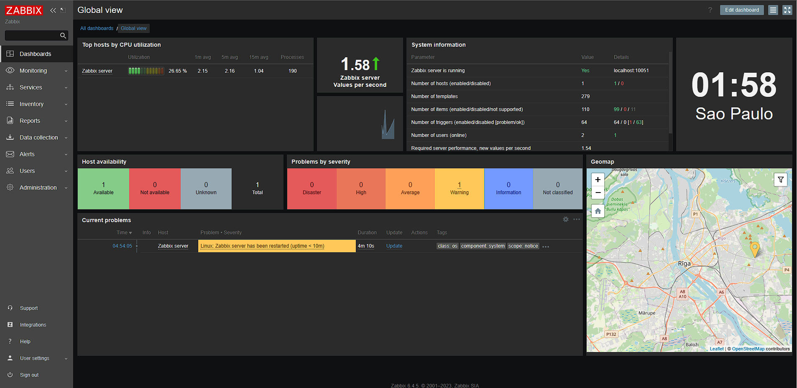

# Configuração do Zabbix Server com Vagrant

Este guia descreve como criar uma máquina virtual (MV) usando Vagrant e instalar o serviço do Zabbix Server nela. O Zabbix Server é uma plataforma de monitoramento usada para rastrear o desempenho de dispositivos e sistemas em uma rede.

## Configuração do Ambiente de Desenvolvimento

### Pré-requisitos
Certifique-se de que o Vagrant esteja instalado no seu sistema.

### Clone o Repositório
Faça o download ou clone o repositório com o nome "vagrant-zabbix-server" em sua máquina local.

## Configuração da Máquina Virtual com Vagrantfile

### Espelho de Imagem
Utilize o espelho de imagem da MV com Ubuntu 20.04 (Focal Fossa) fornecido no seguinte link:
[Ubuntu 20.04 (Focal Fossa)](https://app.vagrantup.com/ubuntu/boxes/focal64)

### Configuração do Vagrantfile
Abra o arquivo Vagrantfile e configure-o com as seguintes informações:
- Nome da MV.
- Tipo de rede (public_network).
- Especificação das portas (forwarded_port) para comunicação entre a MV e o host. Neste exemplo, usamos a porta 80 na MV para se comunicar com a porta 80 do host.

## Execução do Script de Instalação do Zabbix Server

### Execução do Script
Dentro da MV, execute o script "zabbix.sh" para realizar as seguintes ações:
- Atualizar os repositórios.
- Instalar o MySQL.
- Configurar o MySQL com as opções necessárias.
- Instalar o Zabbix Server e suas dependências.
- Configurar o Zabbix Server e definir senhas.
- Reiniciar os serviços relevantes.

## Configuração do Zabbix Server

### Acesso à Interface Web do Zabbix
Após a conclusão do script de instalação, acesse a interface web do Zabbix no navegador, digitando o IP da MV seguido por "/zabbix".

### Configuração Inicial
Realize a configuração inicial fornecendo o seguinte:
- Usuário: Admin
- Senha: zabbix

